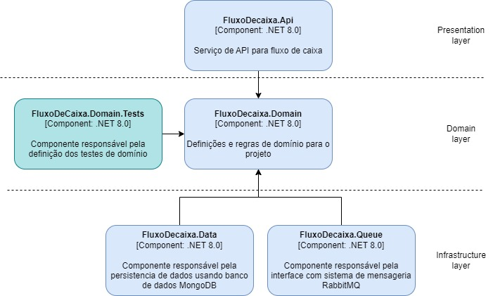
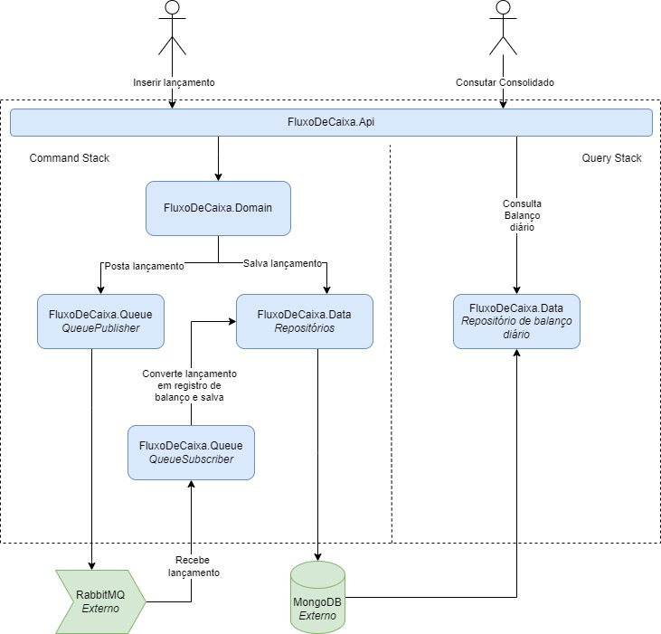
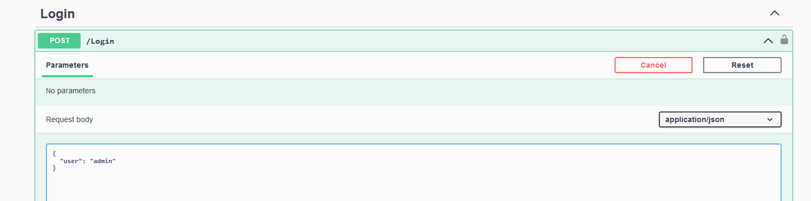
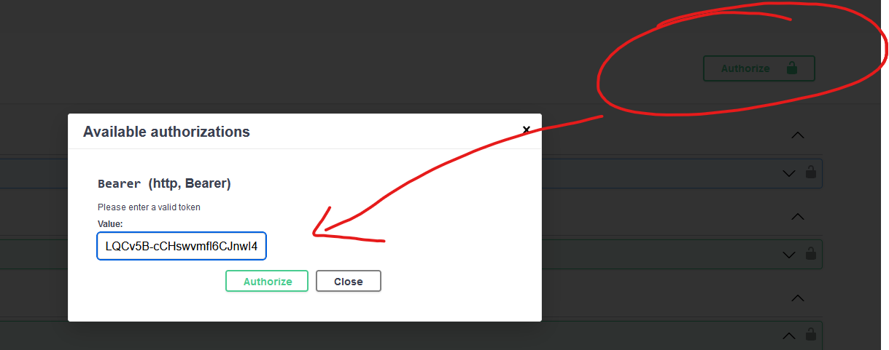
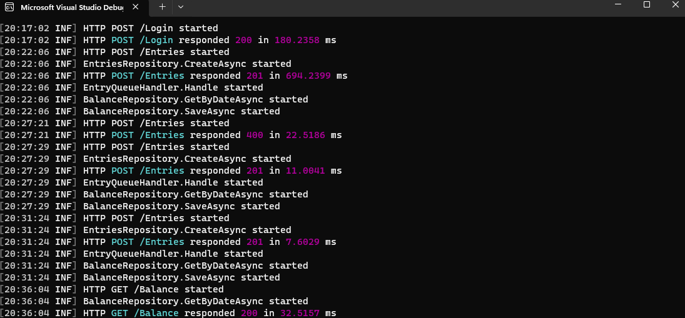
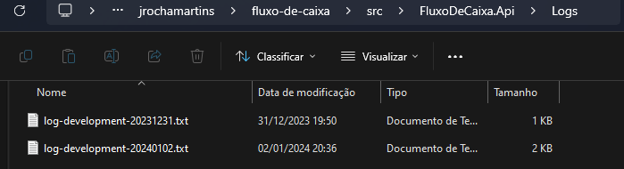

# Fluxo de caixa: Projeto de exemplo
Este repositório apresenta um projeto de exemplo que destaca habilidades técnicas de desenvolvimento de software.
Os detalhes incluem o desenho solução, boas práticas, frameworks utilizados e instruções para execução local do projeto.

## Descritivo do problema
Um comerciante precisa controlar o seu fluxo de caixa diário com os lançamentos (débitos e créditos), também precisa de um relatório que disponibilize o saldo diário consolidado.

### Requisitos de negócio
- Serviço que faça o controle de lançamentos
- Serviço do consolidado diário

## Desenho da Solução
### Diagrama estrutural
A solução faz uso de arquitetura de portas e adaptadores e padões de serparação de responsabilidade em 3 camadas, contendo:
- <strong>FluxoDeCaixa.Api:</strong> Projeto responsável por expor camada de API, reprentando as portas de entrada da aplicação. Por questões didáticas essa camada também é responsável por resolver todas as dependencias necessárias para inciar o sistema.
- <strong>FluxoDeCaixa.Domain:</strong> Domínio de negócio da solução, possúi regras de negocio da aplciação desacopladas das tecnologias usadas para entrada e persistencia de dados.
- <strong>FluxoDeCaixa.Data:</strong> Projeto responsável por realizar interface com banco de dados. Conhece as regras de domínio mas é agnóstico das fontes de entrada da aplicação.
- <strong>MongoDB:</strong> Para manter o estado tanto dos lançamentos quanto das informações consolidadas foi usado o MongoDB principalmente para sua simplicidade em termos de carga computacional.
- <strong>FluxoDeCaixa.Queue:</strong> Projeto responsável por realizar interface sistema de mensageria e implementar padrão pub/sub, representa adaptador da aplicação.
- <strong>RabbitMq:</strong> Como sistema de mensageria foi usado o RabbitMQ. A mensageria foi empregada visando o desacoplamento e resiliencia no processamento de carga da aplicação.



### Diagrama comportamental

Internamente, a solução faz uso de estilo arquitetural CQRS para prover as funcionalidades principais da aplicação. O estilo foi escolhido por empregar um desacoplamento entre a escrita e leitura de informações, sendo adequado aos requisitos funcionais do negócio, bem como requisitos não fucionais de resiliencia e disponibilidade.



- <strong>Inserir lançamento:</strong> Quando o usuário envia os dados para cadastro de um lançamento, a informação é recepcionada pela API que faz as conversões necessárias e envia para o domínio que é responsável por validar a consistência da informação. Em caso de erro o domínio notifica a API sobre o problema, do contrário, este encaminha a informação para ser persitida e também publica uma mensagem em uma fila. Um componente que assina essa fila, recebe a mensagem e a repassa para o repositório de informações consolidadas que sicroniza a informação com a base de dados de leitura.
- <strong>Consultar relatório diário consolidado:</strong> Como a informação já foi sinronizada, essa operação apenas lê, a partir do reposório, a ultima informação salva e a retorna para o usuário.

Como pode ser notado, a solução tras consitência eventual entre o momento de cadastro e leitura do relatório, o sincronismo depende da capacidade computacional do ambiente porém, permite maior disponibildiade das operações, visto que estão desacopladas, principalmente, pelo sistema de mensageria RabbitMQ.

## Preparação do ambiente local
### Pre-requisitos
A aplicação é multi-plataforma, porém os exemplos abaixo contemplam a execução em uma estão com sistema operacioal Windows.

Para rodar o sistema localmente as aplicações abaixo precisam estar instaladas na estação de trabalho. 

1. [Git Client](https://gitforwindows.org/)
2. [.NET SDK 8](https://dotnet.microsoft.com/en-us/download)
3. [Docker Desktop](https://www.docker.com/products/docker-desktop/)

## Instruções para execução do projeto localmente
Após a instalação dos pre-requisitos, siga estas etapas para executar o projeto em sua máquina local:

1. Clonar o Repositório:
Abra o terminal no diretório de sua escolha e execute o seguinte comando para clonar o repositório do GitHub:
```bash
  git clone https://github.com/jrochamartins/fluxo-de-caixa.git
```

2. Iniciar as dependencias do projeto:
- Navegue até a pasta scripts e execute o arquivo em lotes ```start.bat```

<em>Obs: Mantenha esse terminal rodando até o terminar o teste local.</em>

3. Iniciar a aplicação:
- Volte a pasta raiz da aplicação.
- Abra a aplicação diretamente no Visual Studio 2022
- Ou então execute, via linha de comando, as instruções abaixo:
```shell
  dotnet restore
  dotnet build
  dotnet run --project .\src\FluxoDeCaixa.Api\FluxoDeCaixa.Api.csproj
```

4. Acessar a interface swagger:
* Após executar o projeto, abra um navegador da web e acesse a URL: https://localhost:5001/swagger/index.html

5. Autenticando na API
* A API oferece um endpoint POST /Login onde é possível gerar o token para ser trafegado no Header das demais requisições
* Para fins didáticos, basta usar o texto ```admin``` para receber o token



* Com o token copiado, clique no botão <strong>Autorize</strong> no topo da tela e cole o token no campo de texto

 

### Serviços disponíveis
#### [POST] - Autenticar usuário: https://localhost:5001/Login
```json
{
	"user": "admin"
}
```
| Campo | Obrigatório | Descrição |
| ------ | ------ | ------ |
| user | sim | Usuário que está se autenticando na aplicação, usar padrão ```admin``` |


#### [POST] - Adicionar entrada: https://localhost:5001/Entries
```json
{
	"date": "2024-01-02T23:00:00.000Z",
	"entryType": 1,
	"description": "Decrição",
	"value": 50
}
```
| Campo | Obrigatório | Descrição |
| ------ | ------ | ------ |
| date | não | Data do lançamento, se não for informado será considerádo a data e hora atuai. |
| entryType | sim | Tipo de lançamento. 1 para cédito, 2 para débito. |
| description | sim | Descrição do lançamento. |
| value | sim | Valor do lançamento. |

#### [GET] - Relatório consolidado diário: https://localhost:5001/Balance?Day=day&Month=month&Year=year
| Campo | Obrigatório | Descrição |
| ------ | ------ | ------ |
| day | sim | Dia do relatório.  |
| month | sim | Mês do relatório. |
| year | sim | Ano do relatório. |

* Resultado
```json
{
	"date": "2024-01-02",
	"credits": 150,
	"debts": 0,
	"value": 150
}
```

## Solução de problemas

Para solução de problemas é possível consultar os logs da aplicação diretamente no terminal ou também em arquivo de logs indexados por dia na pasta ```\src\FluxoDeCaixa.Api\Logs```

* Console
 

* Arquivos de log
 